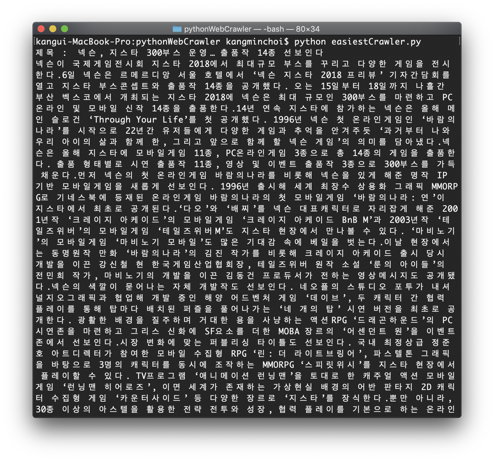
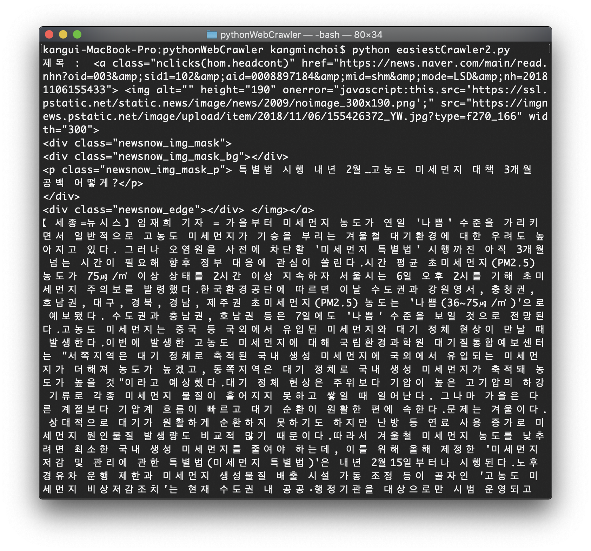
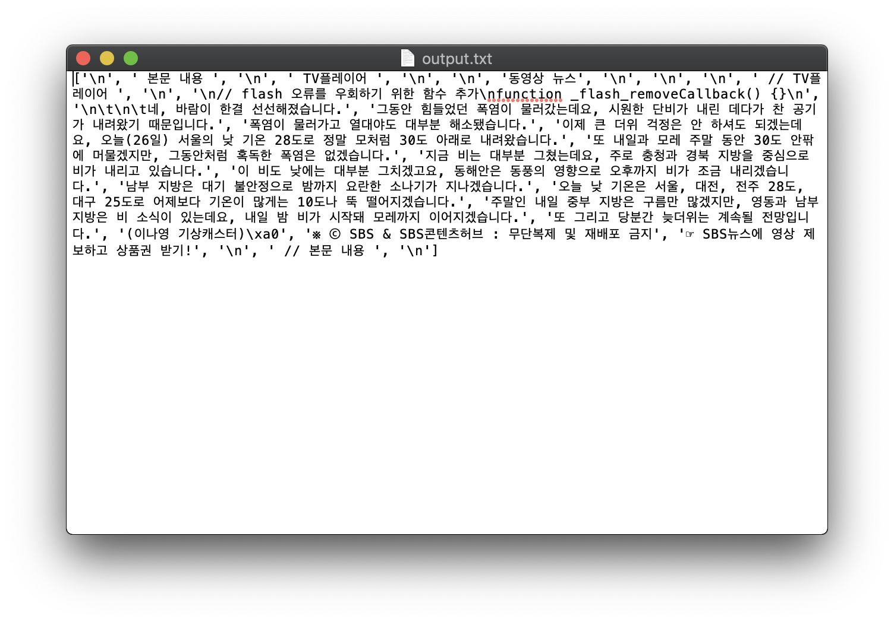

# 파이썬으로 홈페이지 게시글 내용 긁어오자

## 네이버 기사, 블로그, 게시판 등 어떤 형식이든 긁어봅시다
> 개인정보나 민감한 정보도 긁어올 수 있으니 조심합시다

### 네이버 기사, 뉴스, 실시간 검색어 등을 가져옵시다

# BeautifulSoup란 라이브러리를 사용합니다

파이썬에서 웹크롤링할 때 많이 사용하는 라이브러리입니다.  
크롤링의 활용은 무궁무진합니다.  
데이터를 가져와 뿌리는 모든 웹or앱에 사용하니 알아둡시다  
[op.gg](http://www.op.gg/)가 크롤링만 사용한 대표적인 비즈니스 모델입니다.  

라이브러리 활용법은 아래 링크를 찾아봅시다.  
[Beautiful Soup 라이브러리 사용법](https://www.crummy.com/software/BeautifulSoup/bs4/doc/)


## 그나마 쉬운 방법으로 긁어보고

긁으면 위의 이미지처럼 나옵니다
```python
# 웹 크롤링에 도움 줄 모듈 추가하기
import urllib.request
from bs4 import BeautifulSoup
import time

# 기사목록 가져오기
  # 크롤링 하고 싶은 URL을 넣자
# 네이버 뉴스 url ="https://news.naver.com" 이것도 해보자!
# 네이버 뉴스 : IT/과학  
url ="http://news.naver.com/main/main.nhn?mode=LSD&mid=shm&sid1=105"
  # URL을 열면 나오는 홈페이지 내용
response = urllib.request.urlopen(url)

# html.parser를 이용해 기사를 끌어오자
soup = BeautifulSoup(response, "html.parser")
results = soup.select(".cluster_item .cluster_text a")

# 기사 하나씩 가져오자
for result in results:
  # 제목
  print("제목 : ", result.string)
  # 기사 링크 가져와서
  url_article = result.attrs["href"]
  # 링크로 기사 열어보기
  response = urllib.request.urlopen(url_article)
  soup_article = BeautifulSoup(response, "html.parser")
  content = soup_article.select_one("#articleBodyContents")

  # 사람이 읽을 수 있게 가공합시다
  output = ""
  for item in content.contents:
    stripped = str(item).strip()
    if stripped == "":
      continue
    if stripped[0] not in ["<", "/"]:
      output += str(item).strip()
  output.replace("&apos;", "")
  print(output.replace("본문 내용TV플레이어", ""))

  # 5초 대기 -> 왜 대기할까요??
  time.sleep(5)
```
## 네이버 뉴스 홈을 긁어보고

내용만 뽑아내기가 쉽지 않네요   
#### 제목이 넘 길게 나와
```python
# 웹 크롤링에 도움 줄 모듈 추가하기
import urllib.request
from bs4 import BeautifulSoup
import time

# 기사목록 가져오기
  # 크롤링 하고 싶은 URL을 넣자
  # 네이버 뉴스로 해보자
url ="https://news.naver.com" 

  # URL을 열면 나오는 홈페이지 내용
response = urllib.request.urlopen(url)

# html.parser를 이용해 기사를 끌어오자
soup = BeautifulSoup(response, "html.parser")
lists = soup.find_all("a", attrs={"class" : "nclicks(hom.headcont)" })

# 기사 하나씩 가져오자
for list in lists:
  # article = list.select(".newsnow_tx_inner a")
  # 제목
  print("제목 : ", list)
  # 기사 링크 가져와서
  url_article = list.attrs["href"]
  # 링크로 기사 열어보기
  response = urllib.request.urlopen(url_article)
  soup_article = BeautifulSoup(response, "html.parser")
  content = soup_article.select_one("#articleBodyContents")

  # 사람이 읽을 수 있게 가공합시다
  output = ""
  for item in content.contents:
    stripped = str(item).strip()
    if stripped == "":
      continue
    if stripped[0] not in ["<", "/"]:
      output += str(item).strip()
  output.replace("&apos;", "")
  print(output.replace("본문 내용TV플레이어", ""))

  # 5초 대기 -> 왜 대기할까요??
  time.sleep(5)
```
## 긁어온 데이터를 txt 파일에 넣어봅시다

긁어온 내용을 이런식으로 넣어봅시다
첫번째, 2번째 예시들에 표현 정규식을 이용해   
깔끔한 결과가 나오게 하는 부분은 빼고 진행합니다
```python
# 무엇을 긁어올까요?
 
from bs4 import BeautifulSoup
import urllib.request
 
# 출력 파일 명
OUTPUT_FILE_NAME = 'output.txt'
# 긁어 올 URL
URL = 'http://news.naver.com/main/read.nhn?mode=LSD&mid=shm&sid1=103&oid=055'\
      '&aid=0000445667'
 
 
# 크롤링 함수
def get_text(URL):
    source_code_from_URL = urllib.request.urlopen(URL)
    soup = BeautifulSoup(source_code_from_URL, 'lxml', from_encoding='utf-8')
    text = ''
    for item in soup.find_all('div', id='articleBodyContents'):
        text = text + str(item.find_all(text=True))
    return text
 
 
# 메인 함수
def main():
    open_output_file = open(OUTPUT_FILE_NAME, 'w')
    result_text = get_text(URL)
    open_output_file.write(result_text)
    open_output_file.close()
    
 
if __name__ == '__main__':
    main()

```

## 더 공부하고 싶다면?
> 아래의 문서 및 블로그를 참고해 위의 자료를 만들었습니다  

[웹크롤러 위키백과](https://ko.wikipedia.org/wiki/%EC%9B%B9_%ED%81%AC%EB%A1%A4%EB%9F%AC)  
[나만의 웹크롤러 만들기 웹북](https://beomi.github.io/gb-crawling/)  
[웹크롤러 블로그 포스팅 1](http://sensibilityit.tistory.com/491)  
[웹크롤러 블로그 포스팅 2](http://jay-ji.tistory.com/16)  
[웹크롤러 블로그 포스팅 3](http://yoonpunk.tistory.com/4)
